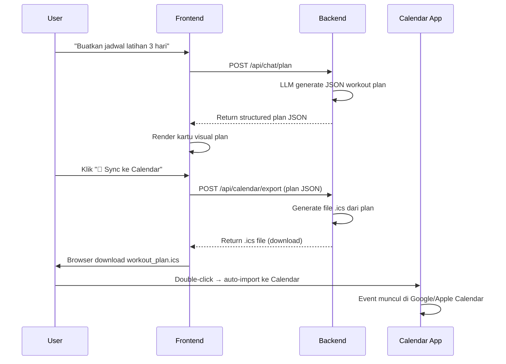
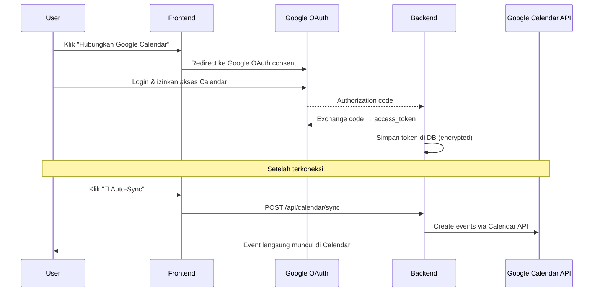
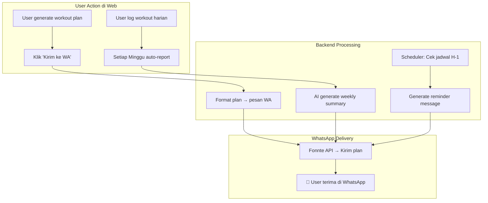
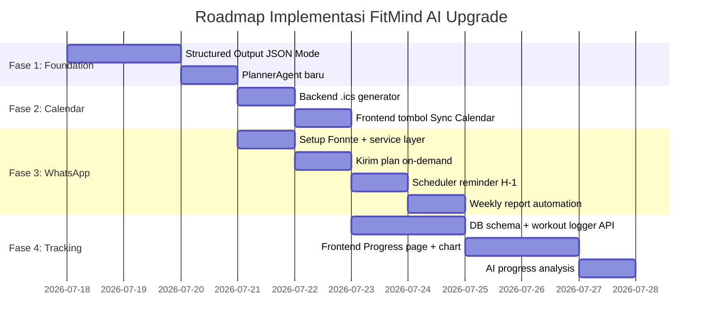

# 📋 Implementation Plan — FitMind AI Upgrade & Automation

## 🎯 Tujuan
Meng-upgrade FitMind AI agar memiliki **nilai jual unik** yang **tidak bisa direplikasi** hanya dengan mengetik di Gemini. Fokus: **Automation ke WhatsApp & Google Calendar** + fitur tracking personal.

---

## Gambaran Besar: Sebelum vs Sesudah

```
SEBELUM (Sekarang):
User → Tanya AI → Dapat teks jawaban → Selesai (sama seperti pakai Gemini)

SESUDAH (Upgrade):
User → Tanya AI → Dapat STRUCTURED plan → 
  ├── 📅 Auto-sync ke Google Calendar (jadwal latihan)
  ├── 📱 Reminder otomatis via WhatsApp (H-1 latihan)
  ├── 📊 Log workout → AI analisis progress mingguan
  └── 📤 Weekly report dikirim ke WhatsApp setiap Minggu malam
```

---

## Arsitektur Baru (Setelah Upgrade)

```mermaid
graph TD
    A[React Frontend] --> B[FastAPI Backend]
    B --> C[Multi-Agent System]
    C --> D[FitnessAgent]
    C --> E[NutritionAgent]
    C --> F[HealthAgent]
    C --> G["🆕 PlannerAgent"]
    
    G -->|JSON Mode| H["Structured Output Engine"]
    H -->|.ics file| I["📅 Google Calendar Sync"]
    H -->|Fonnte API| J["📱 WhatsApp Notifications"]
    
    B --> K["🆕 Workout Logger"]
    K --> L["🆕 ProgressAgent"]
    L -->|Weekly Cron| J
    
    B --> M["🆕 Scheduler Service"]
    M -->|Reminder H-1| J
    M -->|Event Create| I

    style G fill:#1a3a1a,stroke:#22c55e
    style H fill:#1a3a1a,stroke:#22c55e
    style I fill:#1a2a3a,stroke:#3b82f6
    style J fill:#1a3a2a,stroke:#25D366
    style K fill:#1a3a1a,stroke:#22c55e
    style L fill:#1a3a1a,stroke:#22c55e
    style M fill:#3a2a1a,stroke:#f59e0b
```



---

## 📦 Fase 1: Structured Output (JSON Mode) — 2 Hari

> **Mengapa ini harus duluan?** Semua automation (Calendar, WhatsApp) membutuhkan output terstruktur dari LLM. Tanpa ini, tidak ada data yang bisa di-automate.

### Apa yang berubah

| File | Perubahan |
|---|---|
| `agents/fitness_agent.py` | Tambah `response_schema` untuk workout plan JSON |
| `agents/nutrition_agent.py` | Tambah `response_schema` untuk meal plan JSON |
| `agents/base_agent.py` | Tambah method `stream_structured()` dengan JSON mode |
| `routers/chat.py` | Endpoint baru: `POST /api/chat/plan` (non-streaming, return JSON) |
| Frontend: `ChatPage.jsx` | Render JSON sebagai kartu visual + tombol "Sync ke Calendar" & "Kirim ke WA" |

### Contoh Flow

```
User: "Buatkan jadwal latihan 3 hari untuk pemula"

SEBELUM → Teks markdown panjang
SESUDAH → JSON terstruktur:
{
  "plan_type": "workout",
  "title": "Program Pemula 3 Hari",
  "schedule": [
    {
      "day": "Senin",
      "focus": "Upper Body",
      "exercises": [
        {"name": "Bench Press", "sets": 3, "reps": "10-12", "rest_sec": 90},
        {"name": "Lat Pulldown", "sets": 3, "reps": "10-12", "rest_sec": 90}
      ]
    },
    {
      "day": "Rabu", "focus": "Lower Body", "exercises": [...]
    },
    {
      "day": "Jumat", "focus": "Full Body", "exercises": [...]
    }
  ]
}
```

### Backend: Endpoint Baru

```python
# routers/plans.py (BARU)
@router.post("/generate")
async def generate_plan(request: PlanRequest):
    """Generate workout/meal plan sebagai JSON terstruktur."""
    # 1. Agent generate JSON via Gemini JSON Mode
    # 2. Return structured data + render di frontend
    # 3. Frontend tampilkan tombol "📅 Sync Calendar" dan "📱 Kirim WA"
```

### Frontend: Kartu Visual Plan

```
┌──────────────────────────────────────┐
│  📋 Program Pemula 3 Hari           │
├──────────────────────────────────────┤
│  🔴 Senin — Upper Body              │
│  • Bench Press    3×12  (90s rest)   │
│  • Lat Pulldown   3×12  (90s rest)   │
│  • Shoulder Press 3×10  (90s rest)   │
│                                      │
│  🟡 Rabu — Lower Body               │
│  • Squat          4×10  (120s rest)  │
│  • Leg Press      3×12  (90s rest)   │
│  ...                                 │
├──────────────────────────────────────┤
│  [📅 Sync ke Calendar] [📱 Kirim WA]│
└──────────────────────────────────────┘
```

---

## 📅 Fase 2: Google Calendar Integration — 2-3 Hari

### Opsi A: File .ics (Tanpa OAuth — REKOMENDASI untuk project kampus)

> [!TIP]
> Opsi ini **paling realistis** untuk project kampus. Tidak perlu Google OAuth, tidak perlu credential. User download file .ics → import ke Google Calendar / Apple Calendar.

**Alur:**


**Backend: Generator .ics**

```python
# routers/calendar.py (BARU)
from icalendar import Calendar, Event
from datetime import datetime, timedelta

@router.post("/export")
async def export_to_calendar(plan: WorkoutPlanSchema):
    """Convert workout plan JSON → .ics calendar file."""
    cal = Calendar()
    cal.add('prodid', '-//FitMind AI//Workout Plan//ID')
    
    # Mapping hari ke tanggal minggu ini
    day_map = {"Senin": 0, "Selasa": 1, "Rabu": 2, ...}
    
    for session in plan.schedule:
        event = Event()
        event.add('summary', f"🏋️ {session.focus}")
        event.add('description', format_exercises(session.exercises))
        event.add('dtstart', next_weekday(day_map[session.day], hour=7))
        event.add('dtend', next_weekday(day_map[session.day], hour=8))
        event.add('location', 'Gym')
        # Reminder 1 jam sebelum
        from icalendar import Alarm
        alarm = Alarm()
        alarm.add('trigger', timedelta(hours=-1))
        alarm.add('action', 'DISPLAY')
        event.add_component(alarm)
        cal.add_component(event)
    
    return Response(
        content=cal.to_ical(),
        media_type="text/calendar",
        headers={"Content-Disposition": "attachment; filename=fitmind_workout.ics"}
    )
```

**Dependency baru:** `pip install icalendar`

### Opsi B: Google Calendar API (Full OAuth — Untuk Versi Lanjut)

**Alur:**


> [!WARNING]
> Google OAuth memerlukan Google Cloud Console setup + verified domain. Untuk demo/project kampus, **Opsi A (.ics)** jauh lebih praktis.

---

## 📱 Fase 3: WhatsApp Automation — 3-4 Hari

### Opsi yang Tersedia

| Opsi | Biaya | Kesulitan | Cocok Untuk |
|---|---|---|---|
| **Fonnte.com** | Gratis trial / 99rb/bln | ⭐ Mudah | ✅ Project kampus (REKOMENDASI) |
| **Twilio WhatsApp** | $0.005/pesan | ⭐⭐ Sedang | Production |
| **WhatsApp Cloud API (Meta)** | Gratis 1000 pesan/bln | ⭐⭐⭐ Sulit | Production scale |
| **wa.me deep link** | Gratis | ⭐ Mudah | Fallback sederhana |

### Rekomendasi: Fonnte.com (Paling Cocok untuk Skripsi)

**Alur Lengkap WhatsApp Automation:**



### 3 Jenis Pesan WhatsApp

#### 1️⃣ Kirim Workout Plan (On-Demand)

User klik tombol → plan dikirim ke WA mereka.

```python
# services/whatsapp.py (BARU)
import httpx

FONNTE_TOKEN = os.getenv("FONNTE_TOKEN")

async def send_whatsapp(phone: str, message: str):
    """Kirim pesan WA via Fonnte API."""
    async with httpx.AsyncClient() as client:
        resp = await client.post(
            "https://api.fonnte.com/send",
            headers={"Authorization": FONNTE_TOKEN},
            data={"target": phone, "message": message}
        )
    return resp.json()

def format_workout_plan_wa(plan: dict) -> str:
    """Format workout plan JSON → pesan WA yang rapi."""
    lines = [f"🏋️ *{plan['title']}*", f"Generated by FitMind AI", ""]
    for session in plan['schedule']:
        lines.append(f"📅 *{session['day']} — {session['focus']}*")
        for ex in session['exercises']:
            lines.append(f"  • {ex['name']} — {ex['sets']}×{ex['reps']}")
        lines.append("")
    lines.append("💪 Semangat latihan!")
    return "\n".join(lines)
```

**Contoh pesan WA yang diterima user:**
```
🏋️ *Program Pemula 3 Hari*
Generated by FitMind AI

📅 *Senin — Upper Body*
  • Bench Press — 3×12
  • Lat Pulldown — 3×12
  • Shoulder Press — 3×10

📅 *Rabu — Lower Body*
  • Squat — 4×10
  • Leg Press — 3×12

📅 *Jumat — Full Body*
  • Deadlift — 3×8
  • Pull Up — 3×max

💪 Semangat latihan!
```

#### 2️⃣ Reminder H-1 Latihan (Automated)

```python
# services/scheduler.py (BARU)
from apscheduler.schedulers.asyncio import AsyncIOScheduler

scheduler = AsyncIOScheduler()

async def check_tomorrow_workouts():
    """Cek user yang punya jadwal latihan besok, kirim reminder."""
    tomorrow = date.today() + timedelta(days=1)
    day_name = ["Senin","Selasa","Rabu","Kamis","Jumat","Sabtu","Minggu"][tomorrow.weekday()]
    
    # Query DB: user yang punya active plan dengan hari = besok
    users_with_plans = db.query(ActivePlan).filter(
        ActivePlan.schedule_days.contains(day_name)
    ).all()
    
    for plan in users_with_plans:
        msg = f"⏰ *Reminder FitMind AI*\n\nHai {plan.user.username}! Besok jadwal *{plan.focus}*.\nSiapkan perlengkapan gym mu! 💪"
        await send_whatsapp(plan.user.phone, msg)

# Register cron: setiap hari jam 20:00
scheduler.add_job(check_tomorrow_workouts, 'cron', hour=20, minute=0)
```

#### 3️⃣ Weekly Progress Report (Automated)

```python
async def send_weekly_report():
    """Kirim laporan mingguan ke semua user aktif."""
    active_users = get_users_with_logs_this_week()
    
    for user in active_users:
        logs = get_weekly_logs(user.id)
        
        # AI generate summary dari log
        summary = await ai_analyze_weekly_progress(user, logs)
        
        msg = f"""📊 *Laporan Mingguan FitMind AI*
        
Hai {user.username}! Ini ringkasan minggu ini:

✅ Total sesi: {summary['total_sessions']}
🔥 Kalori terbakar: {summary['total_calories']} kkal
📈 Volume naik: {summary['volume_change']}%

💡 *Insight AI:*
{summary['ai_insight']}

Tetap konsisten! 💪"""
        
        await send_whatsapp(user.phone, msg)

# Register cron: setiap Minggu jam 20:00
scheduler.add_job(send_weekly_report, 'cron', day_of_week='sun', hour=20)
```

### Alternatif Gratis: wa.me Deep Link (Tanpa API)

Jika tidak mau pakai Fonnte, bisa pakai deep link yang membuka WhatsApp dengan pesan pre-filled:

```javascript
// Frontend: buka WhatsApp dengan pesan yang sudah diisi
function shareToWhatsApp(plan) {
  const text = formatPlanText(plan)
  const encoded = encodeURIComponent(text)
  window.open(`https://wa.me/?text=${encoded}`, '_blank')
  // → Buka WhatsApp, user tinggal pilih kontak & kirim
}
```

> [!NOTE]
> Deep link ini **gratis dan tanpa API**, tapi user harus manual pilih kontak. Bisa jadi fallback jika Fonnte belum di-setup.

---

## 📊 Fase 4: Workout Logger + Progress Tracking — 3-4 Hari

### Database Schema Baru

```sql
-- Tabel log latihan harian
CREATE TABLE workout_logs (
    id INTEGER PRIMARY KEY,
    user_id INTEGER REFERENCES users(id) ON DELETE CASCADE,
    exercise_name TEXT NOT NULL,
    sets INTEGER,
    reps INTEGER,
    weight_kg FLOAT,
    duration_minutes FLOAT,
    notes TEXT,
    logged_at TIMESTAMP DEFAULT CURRENT_TIMESTAMP
);

-- Tabel active plan (plan yang sedang dijalankan user)
CREATE TABLE active_plans (
    id INTEGER PRIMARY KEY,
    user_id INTEGER REFERENCES users(id) ON DELETE CASCADE,
    plan_json TEXT NOT NULL,        -- Full workout plan dari LLM
    schedule_days TEXT,             -- "Senin,Rabu,Jumat"
    is_active BOOLEAN DEFAULT TRUE,
    created_at TIMESTAMP DEFAULT CURRENT_TIMESTAMP
);

-- Tabel body measurements (tracking progress fisik)
CREATE TABLE body_measurements (
    id INTEGER PRIMARY KEY,
    user_id INTEGER REFERENCES users(id) ON DELETE CASCADE,
    weight_kg FLOAT,
    body_fat_pct FLOAT,
    measured_at TIMESTAMP DEFAULT CURRENT_TIMESTAMP
);

-- Tabel phone untuk WhatsApp
ALTER TABLE user_profiles ADD COLUMN phone VARCHAR(20);
```

### API Endpoints Baru

```
POST   /api/logs                    → Log satu sesi latihan
GET    /api/logs/{username}/weekly  → Data log minggu ini (untuk chart)
GET    /api/logs/{username}/summary → AI-generated summary progress

POST   /api/plans/activate         → Simpan plan sebagai active plan
GET    /api/plans/{username}/active → Ambil active plan user

POST   /api/calendar/export        → Download .ics file dari plan
POST   /api/whatsapp/send-plan     → Kirim plan ke WhatsApp user
```

### Frontend: Halaman Baru "Progress"

```
┌─────────────────────────────────────────┐
│  📊 Progress Minggu Ini                 │
├─────────────────────────────────────────┤
│                                         │
│  Volume per Muscle Group (Bar Chart)    │
│  ████████ Chest: 4500 kg               │
│  ██████   Back: 3800 kg                │
│  █████    Legs: 3200 kg                │
│                                         │
│  📅 Log Terbaru                         │
│  ┌──────────────────────────────────┐   │
│  │ Senin 14 Jul — Upper Body       │   │
│  │ Bench Press: 3×12 @ 60kg ✅     │   │
│  │ Lat Pulldown: 3×12 @ 50kg ✅    │   │
│  └──────────────────────────────────┘   │
│                                         │
│  [+ Log Latihan Hari Ini]               │
│  [📱 Kirim Report ke WA]               │
└─────────────────────────────────────────┘
```

---

## 🗺️ Roadmap & Prioritas



### Total Estimasi: **12-15 hari kerja**

### Jika Waktu Terbatas (MVP 5 Hari):

| Hari | Target |
|---|---|
| **Hari 1** | Structured Output JSON Mode di FitnessAgent |
| **Hari 2** | Frontend: Render plan sebagai kartu + tombol aksi |
| **Hari 3** | Backend: .ics generator + wa.me deep link (gratis) |
| **Hari 4** | Workout Logger: DB + API + form sederhana |
| **Hari 5** | Polish: Dashboard progress + AI weekly insight |

---

## 📁 Struktur File Baru

```
backend/
├── agents/
│   ├── base_agent.py          # + stream_structured() method
│   ├── fitness_agent.py       # + response_schema workout
│   ├── nutrition_agent.py     # + response_schema meal plan
│   ├── health_agent.py
│   ├── planner_agent.py       # 🆕 Agent khusus generate plan
│   └── supervisor.py          # + registry planner agent
├── routers/
│   ├── chat.py
│   ├── plans.py               # 🆕 Generate & manage plans
│   ├── calendar.py            # 🆕 Export .ics
│   ├── whatsapp.py            # 🆕 Send WA messages
│   ├── logs.py                # 🆕 Workout logging
│   └── ...
├── services/
│   ├── whatsapp.py            # 🆕 Fonnte/wa.me integration
│   ├── calendar.py            # 🆕 .ics file generator
│   └── scheduler.py           # 🆕 Cron jobs (reminder, report)
├── database/
│   └── db_models.py           # + WorkoutLog, ActivePlan, BodyMeasurement
└── requirements.txt           # + icalendar, apscheduler

frontend/src/
├── pages/
│   ├── ProgressPage.jsx       # 🆕 Tracking & charts
│   └── ...
├── components/
│   ├── PlanCard.jsx           # 🆕 Render structured plan
│   ├── WorkoutLogForm.jsx     # 🆕 Form log latihan
│   └── ...
```

---

## 🔑 Dependencies Baru

```txt
# requirements.txt (tambahan)
icalendar>=5.0.0          # Generate .ics calendar files
apscheduler>=3.10.0       # Cron jobs untuk reminder & report
```

---

## 💡 Argumen Nilai Jual ke Dosen

Setelah upgrade, FitMind AI menjadi **platform end-to-end** yang:

1. **Gemini tidak bisa**: Generate plan terstruktur → auto-sync ke Calendar
2. **Gemini tidak bisa**: Kirim reminder latihan H-1 via WhatsApp
3. **Gemini tidak bisa**: Track progress latihan dan analisis tren mingguan
4. **Gemini tidak bisa**: Kirim weekly report otomatis ke WhatsApp user
5. **Gemini tidak punya**: Data personal user yang terakumulasi selama berminggu-minggu

> Intinya: Gemini hanya bisa **menjawab pertanyaan**. FitMind AI bisa **mengambil tindakan nyata** (sync calendar, kirim WA, track progress, generate report).
